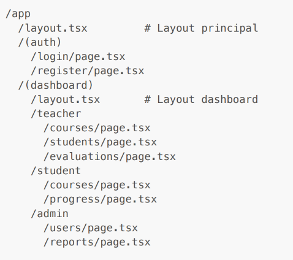

# MusicLearn
## Purpose
- [ ] Create a Next.js application
- [ ] Create authentication and authorization
  - [ ] Professor
  - [ ] Student
  - [ ] Admin
- [ ] Use Tailwind to manage responsive
- [ ] Manage data with serveer actions
- [ ] Use layouts and routing
- [ ] Create validation form
- [ ] Optimizing performances with streaming
- [ ] Meta for SEO

## Pattern
